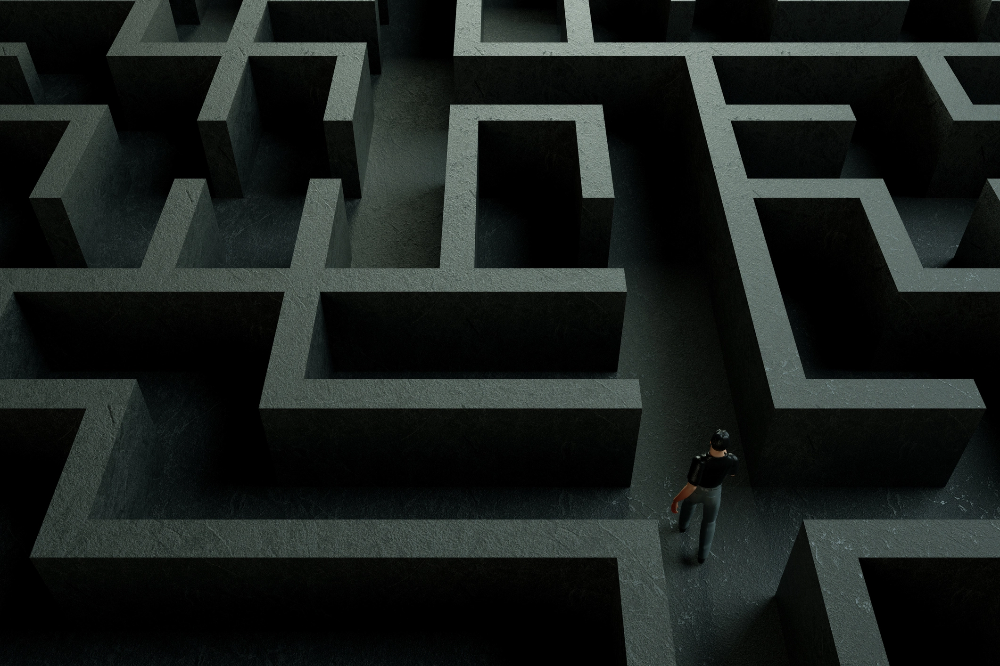
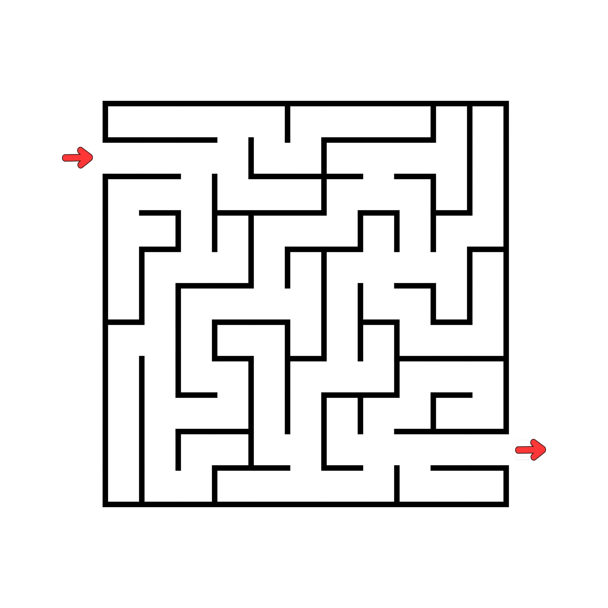

  
  <h1>👾 MAZERS Ver. 1.0 👾</h1>
  
  

  Este proyecto ha sido desarrollado por estudiantes del curso de Programación 3
de la Universidad de Ingeniería y Tecnología 💙🤍. Esperemos les guste. 🎮
    
  

  
Índice:

  <ol>
    <li><a href="#acerca-del-proyecto">
      Acerca del proyecto
      <ul>
        <li><a href="#descripción">Descripción</a></li>
        <li><a href="#características">Características</a></li>
        <li><a href="#tecnologías">Tecnologías</a></li>
        <li><a href="#temas-de-interés">Temas de interés</a></li>
        <li><a href="#algoritmos-y-contenedores-utilizados">Algoritmos y contenedores utilizados</a></li>
      </ul>
    </a></li>
    <li><a href="#instalación">
      Instalación
      <ul>
        <li><a href="#requisitos">Requisitos</a></li>
        <li><a href="#pasos-de-instalación">Pasos de instalación</a></li>
      </ul>
    </a></li>
    <li><a href="#instrucciones-de-uso">
      Instrucciones de uso
    </a></li>
    <li><a href="#licencia">
      Licencia
    </a></li>
    <li><a href="#diagramas">
      Diagramas
      <ul>
        <li><a href="#grafo-del-tablero">Grafo del tablero-11x11</a></li>
        <li><a href="#diagrama-de-clases">Diagrama de clases</a></li>
      </ul>
    </a></li>
    <li><a href="#link-del-video">
      Link del video
    </a></li>
    <li><a href="#autores">
      Autores
    </a></li>
    <li><a href="#referencias-y-links">
      Referencias y links
    </a></li>
  </ol>

---

## Acerca del proyecto

### Descripción

Este proyecto consiste en el desarrollo del mítico juego del laberinto, con varios
añadidos extra e implementaciones que se adaptan a ofrecer la mejor
experiencia de juego posible. Este juego

El proyecto consiste en la elaboración del juego Hex 
tradicional pero con la implementación adicional de 
nuevas características. El juego tiene como objetivo 
ser más flexible para el usuario ya que se da la 
posibilidad de hacer cambios a las características 
de su juego antes, durante y después de haber sido empezado. 
Por otro lado, el usuario tiene la opción de elegir dos opciones 
de juego, puede ser contra otro jugador de forma local o 
contra la computadora.